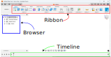
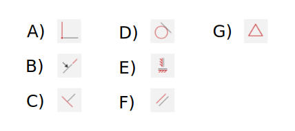
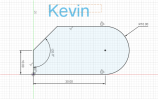
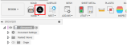

# Overview
In this activity, we'll be learning about how to use the Sketch environment in Fusion. 

Many parametric CAD programs (Fusion, SolidWorks, OnShape, and others) create 3D shapes by first starting with a 2D Sketch, then applying a 3D operation to the elements of the sketch. 

For example, Extruding that sketch creates shapes like prisms or cylinders, Revolves rotate the Sketch around an axis to create shapes like cups, and Lofts connect several Sketches to create more sculptural shapes.

Throughout this assignment, you may need to Google how to do certain operations in Fusion or play around with different buttons within Fusion to see how they work.

1. Layout of Fusion
    1. Open Fusion and start a new project.
    1. There are three major parts of the Fusion interface you'll need to be familiar with:
        1. Ribbon: where all tools can be found.
        1. Browser: where the elements of your design (like Sketches and Bodies) are stored.
        1. Timeline: how Fusion tracks what operations were used to make your model. We won't use it today, but it'll be very important soon.

    

    1. While we're in the beginning, go ahead and save your file, giving it a more meaningful name than "untitled."

1. Creating a new sketch.
    1. Click on the Create Sketch button on the left side of the ribbon.

        

    1. You'll need to pick a plane that this sketch will be on. We have the 3 origin planes right now, but in the future you may want to put a sketch on the face of an existing object. For now, it doesn't matter which plane you choose, but there could be reasons to choose one plane vs another.

        

    1. Notice that the top ribbon changes. One common mistake students make is trying to apply a 3D operation while still in the Sketch environment, so it helps to be able to notice at a glance when you're still in the Sketch environment.

        

1. Line tool: Let's make a simple rectangle. There's a tool for making rectangles, but let's start by using the line tool instead.
    1. Select the line tool from the ribbon or press L. Note: Fusion gives you a description of what every tool does if you hover over it with your mouse.

        
    1. Once you have selected the line tool, head to the next page for how to use it.

1. Line tool and Accidental Constraints: Click the origin as your starting point (almost always a good choice).
    1. Click where you want the line to end, but be careful not to accidentally apply a constraint.
        1. We'll be using constraints liberally shortly, but for now we don't want to accidentally apply one, which looks like one of these blue icons showing up. You'll also notice the line will snap to a position, which you don't want at this stage.

        
    
    1. Click a few more times to create the 4 lines that will eventually become a rectangle, ending back at the origin. In order to be a rectangle, all of the angles must be 90 degrees (there are several ways to do this). Please also align your rectangles sides with the axes (x and y) and make a corner coincident with the origin.

        
    
1. Constraints: Fusion allows you to define relationships between lines and other shapes. These are things like perpendicular, horizontal/vertical, tangent, and many more. These can often be better ways of describing your geometry instead of using dimensions (for example a perpendicular constraint could just be an angle dimension of 90 degrees).
    1. Here are the icons for a few of the constraints and their names. Try to memorize them because you're about to be quizzed on them.
        
        

    1. Quiz on constraints
        Please match the following with their descriptions. Consider using Fusion's tool tips (hover over the icon for a long time) to help you with this quiz.

        

1. Apply constraints to make the four lines into a rectangle with one corner coincident with the origin.

    1. Constraints are applied by first selecting the constraint you want from the ribbon, then select the objects you wish to apply that constraint to.

    1. Note: Sometimes you will get an error when trying to apply too many constraints, either because they aren't possible (two lines can't be perpendicular if you've already dictated that they are 45 degrees apart) or because it is implied by the other constraints (if three corners have perpendicular constraints, the fourth will necessarily also be perpendicular because of geometry rules). This is where accidental constraints can cause issues.

    1. Submit a screenshot here.

1. Text: Text isn't terribly useful, but it does help us know whose work we're looking at. Select the Text tool from the Create menu on the ribbon and add your name somewhere near the rectangle.

    1. To use the Text tool, you'll need to define the two points of the bounding box (aka click twice in different places).

1. Dimensions: Dimensions are the other ways you can define 2D geometry.
    1. The Sketch Dimension tool is under the Create bar on the Ribbon.
        1. Dimensioning a single piece of geometry, such as the length of a line.
        1. Dimensioning between 2 components, like the space between two lines.

1. Challenge: Replicate this shape using lines, arcs, constraints, and the Dimension tool (dimensions are in millimeters). Add your name.

    

    1. Hint: you can start with very rough and clearly wrong lengths and angles, then use dimensions and constraints to turn them into the correct size and shape. This shape can be made with 4 line and one 3-point arc.

    1. Submit screenshot.

1. Exiting the Sketch Environment: When you are done in the Sketch environment, click the "Finish Sketch" button in the top right of the ribbon.
    1. You can re-open a sketch by either double clicking it in the Timeline or double clicking it in the Sketch folder of the Browser.

1. Exporting to laser - You can now do all of the design needed to use the laser cutters, but there are a few more steps to format the file so our lasers can understand them.
    1. Download and install the Shaper Origin tool making sure to select the appopriate OS. [Link here](https://apps.autodesk.com/FUSION/en/Detail/Index?id=3662665235866169729)
        1. On Mac, you may need to use administrator privileges to allow the installation.
    1. Restart Fusion after the installation.
    1. After re-opening your design, open the Sketch dropdown menu in the browser
    1. Select the Origin plugin from the Utilities tab on the ribbon. (note: you will need to be out of the Sketch environment)

        

    1. Check the Advanced option and choose Entire Sketch from the Input Type dropdown.
    1. Select the Sketch in the browser.