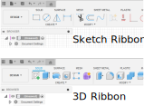
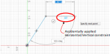

# Overview
In this activity, we'll be learning about how to use the Sketch environment in Fusion.

1. Creating a new sketch.
    1. Click on the Create Sketch button on the left side of the ribbon.

    

    1. You'll need to pick a plane that this sketch will be on. We have the 3 origin planes right now, but in the future you may want to put a sketch on the face of an existing object. For now, it doesn't matter which plane you choose, but there could be reasons to choose one plane vs another.

    

    1. Notice that the top ribbon changes. One common mistake students make is trying to apply a 3D operation while still in the Sketch environment, so it helps to be able to notice at a glance when you're still in the Sketch environment.

    

1. Line tool: Let's make a simple rectangle. There's a tool for making rectangles, but let's start by using the line tool instead.
    1. Select the line tool from the ribbon or press L.

    

    1. Click the origin as your starting point (almost always a good choice).
    1. Click where you want the line to end, but be careful not to accidentally apply a constraint.
        1. We'll be using constraints liberally shortly, but for now we don't want to accidentally apply one, which looks like one of these blue icons showing up. You'll also notice the line will snap to a position, which you don't want at this stage.

        
    
    1. Click a few more times to create the 4 lines that will eventually become a rectangle, ending back at the origin.

        
    
1. Constraints: Fusion allows you to define relationships between lines and other shapes. These are things like perpendicular, horizontal/vertical, tangent, and many more. These can often be better ways of describing your geometry instead of using dimensions (for example a perpedicular constraint could just be an angle dimension of 90 degrees).
    1. Here are the icons for a few of the constraints and what they do. Try to memorize them because you're about to be quizzed on them.
        
        

    1. Quiz on constraints

1. Text: Text isn't terribly useful, but it is for classes so we know whose work we're looking at. Select the text tool from the ribbon and add your name somewhere near the rectangle.

1. Dimensions: These are the other way you can define 2D geometry.
    1. Dimensioning a single piece of geometry, such as the length of a line.
    1. Dimensioning between 2 components, like the space between two lines.

1. Challenge: Replicate this shape using lines, arcs, constraints, and dimensions. Add you name.
    1. Submit screenshot.

1. Exiting Sketch environment

1. Exporting to laser
    1. Download and install the Shaper Origin tool. [Link here](https://apps.autodesk.com/FUSION/en/Detail/Index?id=3662665235866169729)
    1. Restart Fusion after the installation.
    1. After re-opening your design, open the Sketch dropdown menu in the browser
    1. Select the Origin plugin from the Utilities tab on the ribbon. (note: you will need to be out of the Sketch environment)
    1. Check the Advanced option and choose Entire Sketch from the Input Type dropdown.
    1. Select the Sketch in the browser.