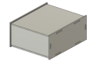
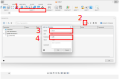
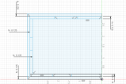
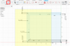
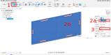
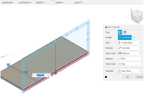
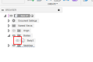
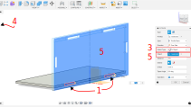
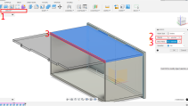

# Overview
In this activity, you'll be learning how to make a box in Fusion. Through this work, you'll learn a great deal about working with one of Fusion's most fundamental methods of creating 3D shapes from 2D sketches: the Extrude feature.

1. You will be making a basic lasercut box with tab joinery in this tutorial. The end result will look something like this:

    

1. Creating a parameter
    1. Open Fusion and start a new file. Measure the thickness of a piece of MDF from the Prototyping Lab using calipers. It should be around 3mm or .125 inches.
    1. We are going to set this as a parameter in Fusion that we can then reference in the dimensions of our Sketches. This is a handy way to quickly update many dimensions at once.
        1. I named mine "thick" because that's easy for me to remember, but feel free to name it whatever makes the most sense to you.
        
        
1. 2D Sketch
    1. Using the knowledge you've gained from the previous Fusion assignment (feel free to use that as a reference), replicate this design.
        1. Instead of typing numbers into the dimension tool, use your parameter by typing "thick" or whatever you named your parameter.
        1. The exact width and length of your box do not matter for this exercise, so use whatever you'd like. The only dimensions that matter are the thickness ones (marked "fx: 0.125"), which you should replace with your parameter.
        
            
1. Mirroring in a Sketch
    1. When your part has symmetry, it saves quite a bit of time (both now and if you have to make edits later) if you only make half of the object, then use the Mirror command.
    1. Note: Box selecting with your mouse works differently if you drag from left to right vs right to left. Try selecting from right to left so the box will select anything the region touches.
    1. Add your name using the Text tool and submit here.

        

1. Extruding the first 
    1. From the top ribbon, click the Extrude button.

        

    1. In the Extrude dialog box, click "Profiles" and select all the sections that make up the first wall of your box. Don't select your name.
    1. Set the distance to "thick." You could manually type in a different number here instead, but let's make use of our parameter.
    1. Click ok.
    1. Notice that the Sketch disappears. We will need it for the future steps too, so click on the Sketch dropdown menu in the Browser and click the eye next to Sketch 1 to make it visible again.
    
        

1. Extruding the floor
    1. Click Extrude and select the areas that make up the floor of your box.
    
        

    1. For distance, type in whatever width you'd like to make your box, but then divide that by two. Fusion can do that math for you and it's good practice to have it do that math. In a later step, we'll mirror the floor to make the other half of it. Taking advantage of symmetry can save you a lot of time when making tweaks to your model later.
    1. You want to extrude away from the first wall you made, so you may need to put a "-" sign in front of the distance number.
    1. If you click "OK" now, Fusion will try to join this wall to your previous wall, which you don't want. To fix this, hide the first wall by clicking on the eye next to that Body in the Body menu in the Browser.

        

1. Extruding the floor tabs
    1. To make the tabs for the floor, click Extrude and select just the tab regions.
    1. We could use our parameter again to make sure the tabs are extruded the right amount, and it would work just fine, but it doesn't really capture our intent. Our intent is that the tabs should go all the way through the side walls and Fusion will let us do that.
    1. Under Extent Type in the Extrude dialog box, select To Object.

        

    1. Make the side wall visible again through the Body dropdown in the Browser.
    1. Select the face of the side wall, then hide that Body again.
    1. This will make the tab go up to the edge of the side wall, no matter how you change the side wall thickness.
1. Extruding the remaining sides
    1. Make the remaining 3 sides by repeating the techniques used to make the floor of the box.
1. Mirroring walls
    1. Select the Mirror feature under the Create section of the Ribbon.

        

    1. Choose a wall to start with (bottom, top, left, or right) and hide the remaining walls in the Browser.
    1. In the Mirror dialog box, select the face at the end of the wall as your Mirror Plane.

        

    1. Click OK to finish the mirror.
1. Mirroring side wall
    1. The Mirror command also works for creating a whole new body, which we'll use to get our second side wall. Click the Mirror command again.
    1. Select Bodies from the dropdown.
    1. Select the side wall.
    1. Use one of the faces from a half wall as the Mirror Plane.
        1. Make sure to hide it in the Browser before clicking OK.
1. Mirror remaining walls
    1. Mirror the remaining walls using the same process we used for the first wall.
1. Final photo 
    1. Submit a screenshot of your final box with your name on it here.
