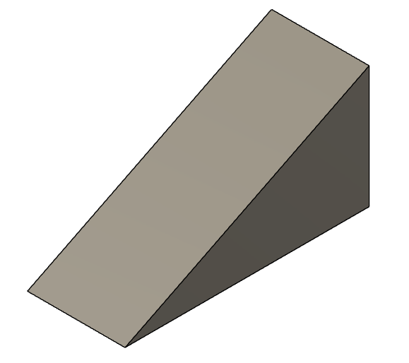
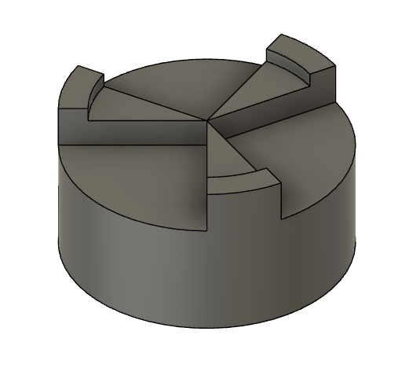
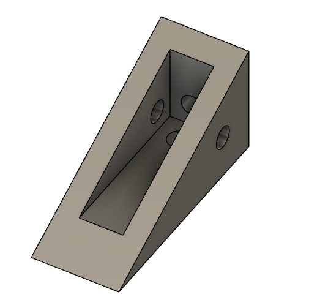

# Overview

# Questions
1. Single Extrude
    

    Let's start with a straightforward extrude. See if you can replicate this object using a single extrude from this engineering drawing:

    [Engineering drawing](assets/wedge_drawing.pdf)

    Student submission: link to Fusion file.

1. Draft
    

    Although it is likely the wrong way to make this part, see if you can replicate it from a rectangular sketch with a Draft angle applied.

    **Note:** Fusion will also do some basic calculations for you, try using the atan() function in the Draft dialog box to get the angle perfect.

    [Engineering drawing](assets/wedge_drawing.pdf)

    Student submission: link to Fusion file.

1. Chamfer
    

    You probably thought that was the last option, but there's at least one more. Try replicating the same part from a rectangular sketch, but this time using the Chamfer feature.

    The default Chamfer feature creates a 45 degree angle by pushing both faces back from the selected edge by the same amount. There is an option in the Chamfer dialog box that will allow you to change this.

    [Engineering drawing](assets/wedge_drawing.pdf)

    Student submission: link to Fusion file.

1. Multiple Extrudes

    

    See if you can replicate this part using a **single Sketch**.

    You can Extrude multiple times from the same Sketch. Extrudes can be used to cut or join, which you can adjust in the Extrude dialog box. Extrudes also don't have to start from the Sketch surface, an offset surface or even an existing surface of your model (object).

    [Engineering drawing](assets/multiple_extrudes_drawing.pdf)

    Student submission: link to Fusion file.

1. Revolve

    

    There's more than one way to make this from a single sketch, this time make it with a **single Sketch** from a side view using the Revolve and Circular Pattern.

    [Engineering drawing](assets/multiple_extrudes_drawing.pdf)

    Student submission: link to Fusion file.

1. 3 Sketches

    

    Try replicating this part with 3 Sketches on orthogonal planes.

    [Engineering drawing](assets/three_sketch_wedge.pdf)

    Student submission: link to Fusion file.

1. 1 Sketch

    

    3 Sketches is really too many, can you do it in 1? I likely wouldn't do this for a model I cared about, but it is a good exercise to get you thinking about how many ways you can make a shape.

    Hint: You will need to use the Revolve feature and explore some of the other options in the Extrude dialog box.
    
    [Engineering drawing](assets/three_sketch_wedge.pdf)

    Student submission: link to Fusion file.

# Resources