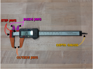
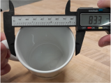
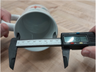
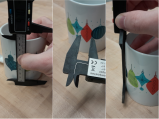
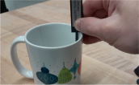

# Overview
To design objects that fit with other objects, you first have to be able to measure. Calipers are one of the most common measurement tools for products that are on the scale of consumer electronics. This activity will show you how to use calipers effectively.

# Learning Objectives
By the end of this activity you will be able to:
- Measure the exterior dimensions of an object
- Measure the interior dimensions of an object
- Measure depths using calipers

1. Calipers are commonly used tools for measuring precise lengths. 
Here's a breakdown of some of the parts we'll be referencing later in this assignment.

1. Grab a simple cup or glass to use for practice.
1. Check for grit on the jaws and make sure it reads 0 when closed.
    1. Common mistakes that result in wrong measurements:
        1. Wipe off if dirty.
        1. Reset if not going to zero.
    1. You can change between metric and imperial depending on which you prefer.

Video on using calipers

# Quiz Style
1. .25 points: Does this number seem right? Y/N
    - 
1. .25 points: What's the likely problem?
    - Low battery.
    - Using the wrong part of the caliper to measure.
    - (Right answer) The calipers aren't zeroed properly.
1. .5 points: Which part of the calipers would you use to measure the outer dimension of this cup?
    
    - (Right answer) Outside jaws
    - Inside jaws
    - Step jwas
    - Depth gauge
1. .5 points: Which part of the calipers would you use to measure the inner diameter of this cup?
    
    - Outside jaws
    - (Right answer) Inside jaws
    - Step jwas
    - Depth gauge
1. .5 points: Which part of the calipers would you use to measure the depth of this cup?
    
    - Outside jaws
    - Inside jaws
    - Step jwas
    - (Right answer) Depth gauge
1. .5 points: What happens when you try to close the jaws really hard?
    1. You generally only want to use enough force to keep the jaws flat on whatever you're measuring and no more.
1. .5 points: Most common use is measuring the outside dimensions of something.
    1. Open the jaws and press them against outside edges of the cup and submit that measurement here.
    1. Make sure the jaws are as flat against the object as they can be. This might be challenging on a tapered glass.

    

1. .5 point: Use the inside jaws to measure the inside diameter of the cup

    

1. .5 point: Use the step to measure the height of the cup from the outside.

    

1. .5 point: Use the depth gauge on the bottom to measure the depth of the cup on the inside.

    

1. 1 points: Use Fusion to draw a cross section of the cup. If you had a tapered cup, you can assume that the walls are vertical using the measurements at the top of the cup.

# Resources
[The Use of Digital Calipers](https://support.bantamtools.com/hc/en-us/articles/115001656313-Proper-Use-of-Digital-Calipers)