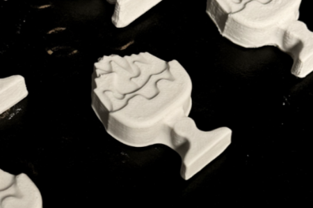
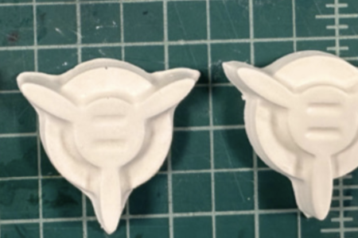
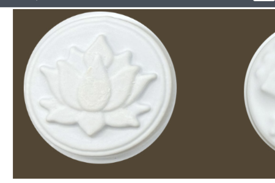
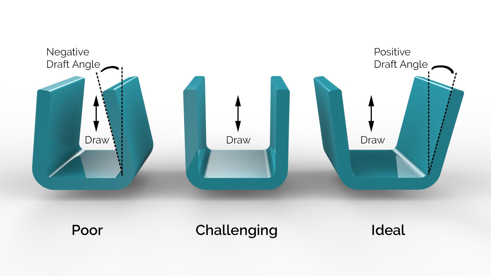

# Overview
You are tasked with designing a mooncake mold using vacuum forming for a hotel chain of your choice and testing it by producing 6x identical mooncakes out of plaster.

To save time and money, you should keep in mind the manufacturing technique you will use to produce your product (often called design for manufacturing or DFM). In your last assignment, you had to design for laser cutting and in this one you'll be designing for a form of molding (sharing some similarities with injection molding).

# Examples

# Learning Objectives
- Conceptualize 3D form
- Visualize conceptual 3D forms using sketching
- Create your own 3D design in CAD
- Understand design for manufacturability (DFM)
- 3D printing
- Vacuum forming

# Constraints
- Your mooncake design must not exceed 50 mm x 50 mm x 20 mm (and not much smaller than this)
- The design must be able to be successfully vacuum formed and molded in plaster
- The design must have a rationale that you can explain

# Deliverables
- Single PDF (<20mb) submitted on Canvas:
    - Your chosen hotel with pictures/notes describing its brand and any other visuals that support your design direction
    - Sketches exploring various designs, and iterations, with notes explaining why you choose one concept over another. At least one sketch must be in an isometric style.
    - Images of molds of at least 3 different versions.
        - These can be testing draft angles, form, decoration, or anything else you'd like to try.
        - Your final "hero" version counts towards these 3.
    - Images of your process: screenshots of CAD, photos of all 3D prints/attempts, photos of vacuum forming and molding plaster
    - An engineering drawing of your final design (use Fusion 360 to produce this)
        - A3 page size, metric units
        - Orthographic views (Top, Front, Right) and an isometric (3d) view.
        - Dimensions (refer to the Types of Dimensions  )
        - Text notes and a title block with detailed information and version number
    - A single, full-page, high-quality ‘hero’ photo of your 6x plaster mooncakes. Make this photo nice so you can use it for your future portfolio. There is a lightbox at GIX, but you may want a darker background for visibility of the plaster.
- A link to your final Fusion 360 CAD model (this is a Fusion link, which you will add as a comment on your Canvas submission)

Please bring all your 3D prints (even failures), all your vacuum-formed molds, and your final 6x plaster mooncakes to class for critique.

# Further Resources
[Engineering drawings and CAD](https://gixlabs.github.io/how_to/fusion.html)

Draft angles:

Refer to this video for guidance on creating draft angles in Fusion 360:

[YouTube draft angles](https://www.youtube.com/watch?v=XL_cEQrksG8&embeds_referring_euri=https%3A%2F%2Fcanvas.uw.edu%2F)
 
# Working with Plaster
- Wear a dust mask, plaster dust is bad for your lungs.
- Mix plaster and water in a 1:1 ratio in a disposable cup.
- Pour the plaster powder into water, little bits at a time (mixing all along), not the other way around.
- The plaster should be smooth and watery when you pour it in the mold.
- **Throw excess away in the trash, don't pour it down the sink!!!!!!**
- The plaster should dry in about an hour and will be soft enough that you can damage it with a fingernail.

# Tips
- Use high wall thickness (+ 3 mm). The melting temperature of the PLA is below the melting material of the material we will be using to make the mold. If you use thin walls, your shape will deform.
- Keep in mind the limitations of vacuum-forming when designing your shapes. Certain shapes will mold better than others. Corners, undercuts, and deep shapes will make it harder or impossible to release the form and mooncake from the mold.
- Use coarse details. Details that are too fine may be lost.
- Remember to provide a generous draft angle (5-10 degrees)
- You should experiment with different draft angles on your prints so that you can see which angle is most successful. It's easiest to do this in a single print job by varying the draft angles on your different shapes.
- 3D printing takes some time. Keep this in mind for time-planning purposes. The 3D printers may be in use by other students and you may have to wait/come back. Don't use more than one printer at a time if other students need them.

# FAQs
- Can I 3D print a smaller-scale version of my design to see if I like it before investing time in printing the 1:1-scale version?
    - Yes! Great idea. Just keep in mind that smaller things can be more challenging to mold, so best to stick to the 1:1 for vacuum forming.
- Can I bake actual mooncakes?
    - Sure! But this isn’t a requirement. You are only required to mold your design in plaster. The HIPS is food safe, but is not oven safe! [Here is an online recipe](https://www.cooking-therapy.com/mooncake-recipe/). (note that the mooncake is not baked in the mold!)
- Can I design in something other than Fusion?
    - No. Sorry, this the Fusion requirement is intended to get all of the students familiar with the same set of tools so they have a common communication tool in future classes. 

# Rubric
| Points | Requirement |
| --- | --- |
| 1 | Description of concept |
| 2.5 | 3+ Hand sketches of different concepts with at least one isometric |
| 0.5 | Engineering drawing |
| 3 | Iteration and notes |
| 0.5 | Fusion 360 link |
| 1 | 6x Final design |
| 1.5 | Execution Quality |