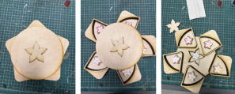
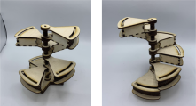
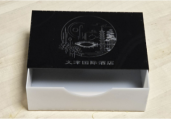
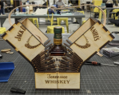

# Overview
In this assignment, you will move beyond stacked construction in order to create more complex 3D forms out of sheet materials. You will be making an enclosure for your 6x mooncakes from the A2.1, using the same hotel as your theme. You will also need to incorporate some moving parts like drawers or hinges.

# Examples

Featuring a lid and moving parts.

A dynamic sculptural enclosure.

Basic drawer, definitely the easiest technique, but this would not have been enough customization if it had used a box generator.

Nice use of springs to provide a dramatic opening experience, from a previous iteration of this assignment that involved packaging beverages.

# Learning Objectives
- Be able to choose the appropriate approach for different stages of the design process
- Demonstrate competence with materials and fabrication processes available to you at GIX
- Be able to explain the benefits and limitations of using different media and prototyping methods
- Be able to adapt or create new designs to accommodate existing or new constraints
- Be able to justify design decisions and articulate a convincing case for design considerations
- Practice 3D modeling skills.
- Practice creating 3D objects from flat materials.

# Constraints
- Final design must be made of flat, sheet materials - plywood, acrylic, cardboard, etc.
- Must contain at least one joint, hinge, pivot, drawer or similar feature.
- Packaging must enclose your 6 mooncakes from A2.1.
- The design should be your own, though starting from a box generator is ok. Provide a link to any box generators or other sources you used.
    - Adding a decorative engraving on a basic box from a box generator is not enough of a change.
- No 3D printing.

# Deliverables
- Process PDF (Submit on Canvas)
    - Brief description of your concept (250 words max)
    - Will be used during critique.
    - Sketches - minimum 10, included in sketchbook and scanned into PDF
    - Handmade prototype to determine overall shape and form
    - Lasercut prototype to test your moving parts (drawer, hinge, etc)
    - 1+ medium fidelity lasercut prototype (final prototype)
    - Notes on what you learned in each prototype
    - Submitted on Canvas, must be under 10 mb in size
- Single SVG containing the files you cut on the lasers for your final prototype.
    - See References section in A1.2 for details on ways to do this using Fusion.
- Link to Fusion model
    - Submitted on Canvas in a comment on your submission.
- In-Class Presentation - Graded in Participation as a separate grade.
    - Bring sketchbook
    - Bring all prototypes (low-fi and medium-fi)
    - Demonstrate during critiques
    - Participate in peer critiques
    - Fill out critique reflection on Canvas

# On Box Generators and Designs
You may use a box generator as a starting point for your enclosure. You may also use existing designs as design inspirations for your work. You **may not** download an existing file and simply modify it slightly and present it as your own work. 

# Rubric
| Points | Requirement |
| --- | --- |
| 1 | Description of concept |
| 3 | 10+ Hand sketches |
| 1.5 | Handcrafted size and shape prototype |
| 1.5 | Lasercut moving parts prototype |
| 0.5 | Fusion 360 link |
| 1 | Final lasercut prototype |
| 1.5 | Execution Quality |