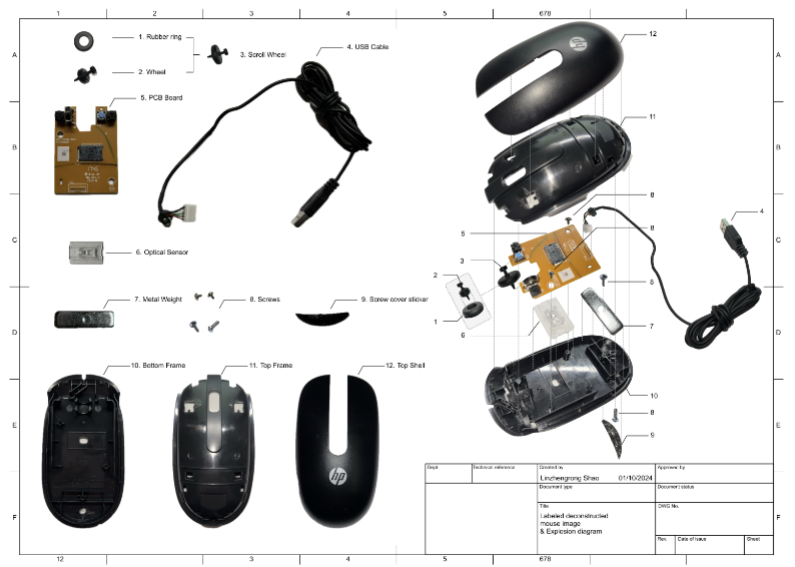

# Overview
Try not to re-invent the wheel. The goal of this assignment is to become familiar with commonly used mass manufacturing and assembly techniques for small consumer electronics containing sensors and microcontrollers. You will investigate by disassembling and documenting a computer mouse provided by us. You will also practice handwork skills and further develop proficiency in working with small components and tools, which are important for product prototyping. You will document your analysis by creating an annotated teardown drawing in this assignment.

# Example

# Learning Objectives
- Learn that everyday objects can teach you a lot about design.
- Practice documentation of physical objects.
- Practice working with small components and tools.
- Learn 2D sketches in CAD.
- Learn how physical objects are defined and constrained in CAD.
- Learn the basics of measurement with calipers.

# Constraints
- Backgrounds must be removed.
- Photos should be clear enough that blurriness is not noticeable.

# Deliverables
- Single PDF (<10 mB) submitted on Canvas
    - Labeled deconstructed mouse image using template.
        - Either name each part or guess at its function.
        - Include explosion lines showing how the parts go together
        - You may use whatever software you would like to create this image (Figma, Inkscape, Illustrator, PowerPoint, MS Paint, etc).
        - Must use the template ([SVG here](assets/mouse_doc/diagram_template.svg) and [PDF here](assets/mouse_doc/diagram_template.pdf)).
    - Bill of Materials (BOM)
        - Table listing all of the parts
        - A guess at what manufacturing process made them.
        - A guess at the material
        - Their quantities (if applicable)
    - A screenshot of your fully constrained Fusion 360 Sketch. All lines should be black and the region filled in with a light blue color. 

Submit this as a single .pdf file (<10 MB). All Deadlines are in Pacific Time (GMT -7).

# Frequently Asked Questions
- Do the items have to be the same scale in the explosion diagram?
    - No, but you may want to scale the smaller parts so their details are visible. That said, the parts should be an appropriate size, so the pieces of the shell shouldn't be wildly different sizes.
- Do we need to dimension the interior cutouts of the PCB?
    - No, just the board outline, with fillets converted to straight edges or a best guess. Interior cutouts aren't required, but dimensioning the holes may be helpful for mounting the PCB in a future assignment.
- Is this Sketch what you meant in Fusion?
    - If the lines are all black and there may a little lock icon on the Sketch in the Browser (left-hand side, may need to expand that category), then it is fully constrained. Since Fusion certainly has quirks and bugs, we only require that the lines all be black and the area bounded by them be filled in with a light blue color (lock icon not required). As long as it also matches the outer border of your PCB, that's all you need.
- Does the Fusion link need to be in the PDF/diagram?
    - We have just changed this, please upload a screenshot of your fully constrained Sketch on Canvas as a separate file from your PDF.

# Resources
We recommend that you use Inkscape to produce the diagram unless you are very familiar with Adobe Illustrator (and have a license to use Illustrator). Inkscape is free. 

If you haven't already, we strongly recommend you work through [these tutorials](https://gixlabs.github.io/how_to/inkscape.html). The techniques described in these tutorials will be used for every 511 assignment.

This is also a great [short video](https://www.youtube.com/watch?v=matqB8nGzQI) on finding parts of your geometry that aren't fully constrained if you're having a hard time getting the lock icon to show up.

# Rubric
| Points | Requirement |
| --- | --- |
| 1 | Full Disassembly |
| 1 | Explosion Lines |
| 1 | Bill of Materials |
| 1 | Fusion 360 Sketch |
| 1 | Execution Quality |
