# Overview
CNC milling is used to make parts directly (Apple's aluminum-bodied laptops) or indirectly (injection molds). The limitations of CNC milling show up in so many designs. Unlike 3D printers, when you use a CNC mill you will have to tell it how to move the cutting head around, which are called toolpaths. This activity will walk you through how to make a basic set of toolpaths that could be used on the CNC router at GIX.

# Learning Objectives
By the end of this activity you will be able to:
- Create your own toolpaths for the CNC router.
- Describe the limitations of CNC milling.

# Quiz Format
1. Open a new Hybrid design project in Fusion.
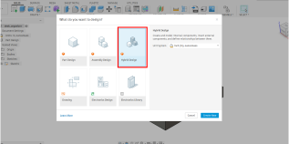
1. Model the desk organizer using a single sketch with multiple extrudes. Use the external dimensions in this engineering drawing to model the outer border. Add at least 3 pockets for things like pens, erasers, SD cards, etc.
- 
Here is an example of what your desk organizer might look like, but make yours fit your needs.
- 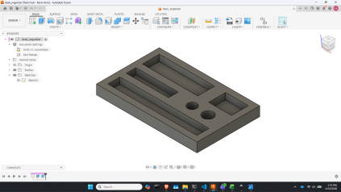
1. Open the Manufacturing tab of Fusion
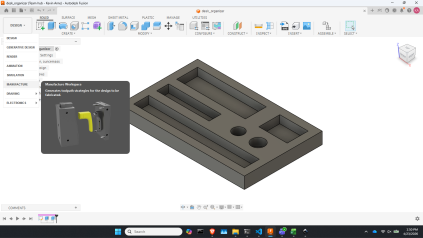
1. Create your stock
The stock is the piece of material you're going to carve the desk organizer out of. Think of it as the piece of wood you buy from the store.
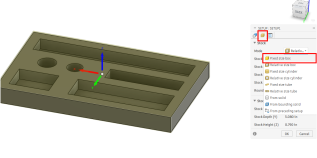
1. Put your origin in the right place.
Select Stock Box Points. For now, place it on the bottom left corner by clicking the circle that shows up. 
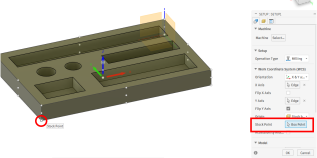
Placement of your origin is heavily dependent on the machine you are using and the geometry of your part and stock. Its placement often determines which features of your design are most accurate, but that isn't a concern this time.
1. Determine your axes.
This needs to match your machine. For our purposes, the long axis should be X and the short axis should by Y, and Z should face upward. If Z doesn't face upward, try flipping your X or Y axes in the Stock dialog box.
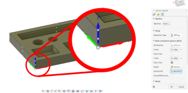

1. Create 2D Pocket toolpaths
    1. Select the 2D Pocket toolpath from the 2D section of the ribbon.
        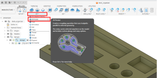
    1. Choose the correct tool (1/4" Flat Endmill)
        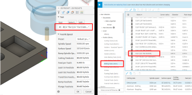
    1. Change the feedrate to 80 in/min. Feedrate is the speed that the cutting tool moves, linearly. Think of it as how fast you would push a piece of wood into a saw. There are a ton of kinds of feedrates (plunge, lead-in, lead-out, ramp) and reasons to tweak all of those numbers, but that is in a realm of process engineering that is outside the scope of this class.
        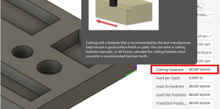
    1. Select the bottom face of each pocket under the Geometry tab. It's very easy to select the wrong thing, so consider rotating the part to be better able to see what you're doing. If you mess this up, it'll be obvious when we simulate the toolpath later.
        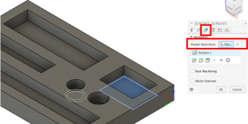
    1. Under the Passes tab, uncheck Stock to Leave. This option is useful if you want to remove most of the material with a rougher bit, before doing another pass with a cleaner bit in another pass, but we'll stick to one pass for this assignment.
        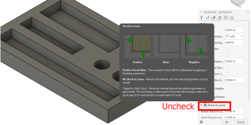
    1. Check the Multiple Depths option and set the Maximum Roughing Stepdown to 0.125". A good default for stepdown (how deep the bit cuts in each pass) is half the diameter of the cutting bit (1/4" bit in our case).
        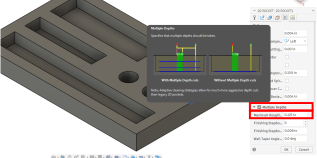
    1. Click OK.
1. Create 2D Contour toolpaths
    1. Select the 2D Contour toolpath
    1. Choose the correct tool (1/4" Flat Endmill) the same way you did for the 2D Pocket. It should save your choice from last time.
    1. Change the feedrate to 80 in/min. This will likely be saved from last time
    1. In the Geomtry tab, select the bottom edge of the exterior of the organizer similarly to how you selected the interior of the pockets on the last toolpath.
    1. Unlike last time, check the Tabs option. The default tabs are ok for our purpose. Since we are cutting our organizer out of a block of wood, once the organizer is freed from the stock (by cutting around the outside border) the organizer could shift around. In a best case scenario, this damages your organizer, but usually it also breaks the rather expensive milling bit. The tabs keep the organizer from shifting around once you're done cutting, then they can be clipped or chiseled off.
        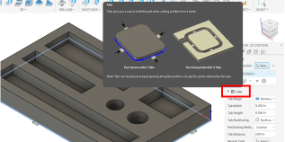
    1. Under the Passes tab, uncheck Stock to Leave, just like last time.
    1. Check the Multiple Depths option and set the Maximum Roughing Stepdown to 0.125" just like last time.
    1. Click OK.
1. Simulate
    1. Right click on the setup in the Browser and select Simulate. Click on the Statistics tab in the Simulate dialog box. How long does it say it's going to take? Over time you will develop intuition on how long a cut should take and this statistic will help you determine whether you've made a mistake.
        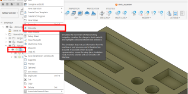
    1. Run the simulation by clicking the big play button at the bottom of the screen. Once the simulation has run, do the pockets have right angled corners? Why or why not? You may need to enable "Stock" on the Display tab so you can see what part of the stock remains after cutting. This is also somewhere that mistakes can show up as red bars.