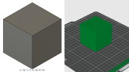
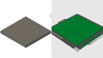
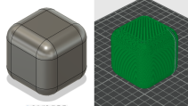
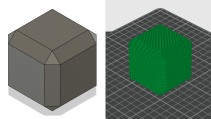
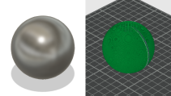
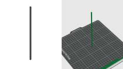
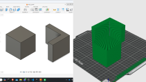
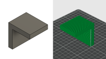

# Overview
The biggest mistake people make when 3D printing is thinking that 3D printers can create any shape without issues. Instead of spending a lot of time printing lots of different objects, this activity is designed to expose you to a few of the limitations of 3D printing.

# Learning Objectives
After this assignment you will be able to:
- Identify common tricky geometries for 3D printing.
- Orient parts on a 3D printer to improve your chance of success.

# Quiz Format
- All answer choices will be the same:
    - No, it will not print
    - Yes, but it will be ugly
    - Yes, with very few defects
- All questions will include two pictures: one in CAD, another from the slicing preview.
- Ideally, after answering the students would see a timelapse of the actual print.

## Will it print
1. 0.2 points: Small cube

1. 0.2 points: Rectangular prism spanning the entire bed.

1. 0.2 points: Small cube with round overs

1. 0.2 points: Small cube with chamfers

1. 0.2 points: Sphere

1. 0.2 points: Tall thin rectanglular prism

1. 0.2 points: Two parts with one not touching the bed

1. 0.2 points: Big unsupported overhang (L shape)

1. 0.2 points: L shape flat on bed
1. 0.2 points: Bridge
